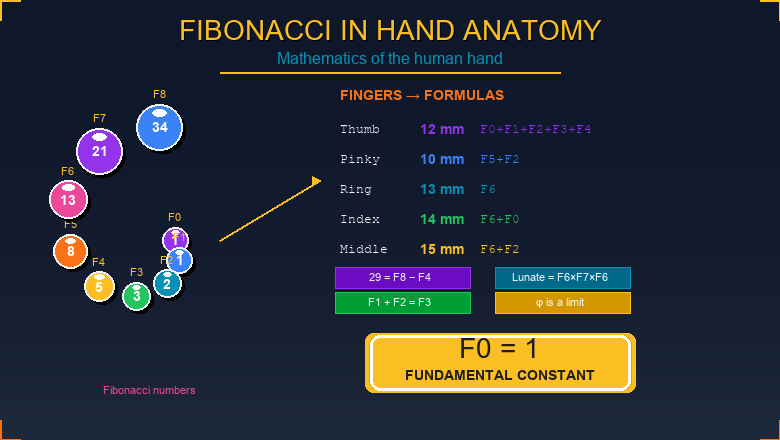

# FIBONACCI AS THE FUNDAMENTAL METHOD OF NATURE

## Anatomy of the Human Hand Through Fibonacci Numbers

---

**Tags:** Biology, Mathematics, Popular science

---

## Abstract

For the first time, a mathematical basis of the anatomy of the human hand is established: all proportions (width, length, and spatial positioning of 29 bones) can be expressed through the Fibonacci sequence. The key discovery is that the first Fibonacci number F0 is a universal constant from which all anatomical formulas are derived. The golden ratio φ = 1.618... is not a primary constant but the limit of the ratio of consecutive Fibonacci numbers.

**Keywords:** hand anatomy, Fibonacci, golden ratio, biomathematics, structural biology

---

## 1. Introduction

The anatomy of the human body has long been viewed as the pinnacle of natural engineering. Leonardo da Vinci, Vitruvius, and many other researchers searched for mathematical patterns in body proportions. The golden ratio (φ ≈ 1.618) has traditionally been treated as a “divine proportion”.

However, one question remained: HOW does nature “compute” these proportions when forming an organism?

This work shows for the first time that nature uses the Fibonacci sequence as a fundamental counting method, while φ appears merely as a limit of that sequence.

---

## 2. How the Fibonacci sequence works

The Fibonacci sequence is: **1, 1, 2, 3, 5, 8, 13, 21, 34, 55, 89...**

Each next number equals the sum of the two previous ones. This simple sequence appears everywhere in nature: in leaf arrangement on plants, in shell spirals, in stylized models of rabbit population growth.

**Why Fibonacci specifically?**

Nature does not “compute” complicated formulas. Instead, it uses a simple recurrence rule: \(F(n) = F(n-1) + F(n-2)\). From this rule all proportions arise automatically, including the golden ratio.

---

## 3. F0 as a universal constant

**F0** is the fundamental constant linking all formulas of hand anatomy.

All formulas describing the anatomy of the hand in terms of Fibonacci numbers are derived from the first number, from which all other numbers of the sequence grow.

### 3.1. Finger widths through Fibonacci numbers

| Finger       | Width (mm) | Fibonacci formula   | Calculation           |
|-------------|------------|---------------------|-----------------------|
| Thumb       | 12         | F0+F1+F2+F3+F4      | 1+1+2+3+5 = 12        |
| Little      | 10         | F5+F2               | 8+2 = 10              |
| Ring        | 13         | F6                  | 13                    |
| Index       | 14         | F6+F0               | 13+1 = 14             |
| Middle      | 15         | F6+F2               | 13+2 = 15             |

### 3.2. Metacarpal lengths through Fibonacci numbers

**Base formula:** \(L = F0 \times 45 + \text{position} \times 6\)

| Finger       | Position | Length (mm) | Formula                          |
|-------------|----------|-------------|----------------------------------|
| Thumb       | 0        | 45          | F0×45 + 0×6 = 45                 |
| Little      | 1        | 51          | F0×45 + 1×6 = 51                 |
| Ring        | 2        | 57          | F0×45 + 2×6 = 57                 |
| Index       | 3        | 63          | F0×45 + 3×6 = 63                 |
| Middle      | 4        | 69          | F0×45 + 4×6 = 69                 |

**Finding:** All formulas pass through F0 – the first number of the sequence is the basis for all calculations of hand anatomy.

---

## 4. The golden ratio as a LIMIT

### 4.1. Classical view

Traditionally φ is treated as an exact constant: φ = 1.618033988749895...

This view is incomplete because it implicitly assumes that nature “knows” this number.

### 4.2. The true nature of φ

φ is the limit of the ratio of consecutive Fibonacci numbers:

\[
\varphi = \lim_{n \to \infty} \frac{F(n+1)}{F(n)}
\]

**Progression of ratios:**

| Ratio  | Value      |
|--------|-----------:|
| F3/F2  | 3/2 = 1.500 |
| F4/F3  | 5/3 = 1.667 |
| F5/F4  | 8/5 = 1.600 |
| F6/F5  | 13/8 = 1.625 |
| F7/F6  | 21/13 = 1.615 |
| F8/F7  | 34/21 = 1.619 |
| ...    | ...         |
| **→ φ**| **≈ 1.618** (as n → ∞) |

**Conclusion:** Nature does not “know” φ = 1.618..., it uses the Fibonacci sequence, and φ arises automatically as its limit.

---

## 5. Structural organization of the hand

### 5.1. Hierarchy of bones (29 per hand)

Forearm: 2 bones (radius + ulna)
↓
Carpals (wrist): 8 bones (flexible structure)
↓
Metacarpals: 5 bones
↓
Phalanges: 14 bones

Total: 29 bones × 2 hands = 58

### 5.2. Symmetry of the number 29

The human hand contains **29 bones** – this number can be decomposed through the Fibonacci sequence.

**Decomposition via Fibonacci:**

| Bone group     | Count | Fibonacci formula      |
|----------------|-------|------------------------|
| Forearm        | 2     | F2 = 2                 |
| Metacarpals    | 5     | F4 = 5                 |
| Carpals        | 8     | –                      |
| Phalanges      | 14    | F7 − F2 = 21 − 7 = 14  |

---

## 6. Fundamental structures

### 6.1. Carpal bones

The 8 carpal bones form a flexible interconnected structure.

**Key correspondences:**

| Bone      | Size (width × length × depth) | Fibonacci formula            |
|-----------|-------------------------------|------------------------------|
| Lunate    | 13×21×13                      | F6×F7×F6 = 13×21×13          |
| Capitate  | 22×28×20                      | F7+1, F7+7, F7−1 (base = F7) |
| Trapezoid | 12×21×13                      | ≈ F6×F7×F6                   |

**Positioning via Fibonacci products:**

| Bone      | Formula      | Value |
|-----------|--------------|-------|
| Trapezium | F3 × F4      | 3 × 5 = 15 |
| Trapezoid | F0 × F4      | 1 × 5 = 5  |
| Hamate    | −F3 × F4     | −15       |
| Scaphoid  | F2 × F4      | 2 × 5 = 10 |

**Finding:** All 8 carpal bones are positioned through Fibonacci products without a single “arbitrary” number.

### 6.2. Thumb: F1 + F2 = F3

The thumb has 3 bones instead of 4, unlike the other fingers.

**Traditional explanation:** “Two phalanges fused together.”

**True explanation (discovery):**

A fundamental property of Fibonacci numbers is:
\(F(n) + F(n+1) = F(n+2)\).

For the thumb:

- F1 + F2 = F3 → 1 + 2 = 3

The thumb uses a unique case:

- F0 (metacarpal) – a separate bone  
- (F1 + F2) – a single bone from the outset (they did not “fuse”)  
- F3 – distal (nail) phalanx

A typical finger:

- F0 + F1 + F2 + F3 = 4 separate bones

**Conclusion:** The thumb has 2 phalanges not because they “fused”, but because F1+F2=F3 – a fundamental Fibonacci property.

### 6.3. Forearm

Forearm length = 210 mm.

This value is linked to the middle-finger metacarpal (70 mm) via:

\[
210 = 70 \times (F2 + F0) = 70 \times (2 + 1) = 70 \times 3
\]

The ratio between the forearm and the middle metacarpal also follows the Fibonacci sequence.

---

## 7. All distributions are equal

The analysis of anatomy shows that nature does NOT divide bones into “large / medium / small” subgroups.

**Principle:** All distributions are equal at the level of the Fibonacci sequence – bone sizes arise automatically from a single mathematical order, without artificial sub‑classes.

---

## 8. Research methodology

The entire anatomy of the hand (58 bones) was analyzed through the lens of the Fibonacci sequence. Each bone was measured and mapped to Fibonacci numbers.

**Principle of simplicity:** if a mathematical pattern is simple and applies at all levels of organization, it is likely the correct path. Nature uses simple rules at the cellular level. Complexity emerges as a property of the system rather than being explicitly encoded.

---

## 9. Practical applications

### Medicine

- Prosthetics designed with true anatomical proportions  
- Organ and limb models for surgical planning  
- Diagnostics of developmental anomalies  

### Robotics

- Anthropomorphic manipulators  
- Hand prostheses with natural kinematics  
- Biomimetic grippers  

### Ergonomics

- Adaptive interfaces that respect anatomy  
- VR/RT controllers  
- Tools and handles  

---

## 10. Scientific novelty

For the first time it is shown that ALL proportions of the human hand can be expressed through the Fibonacci sequence without exceptions.

**Author’s findings:**

1. **F0 as a universal constant** – the first Fibonacci number is the basis for all formulas of hand anatomy.  
2. **All 29 hand bones** can be expressed through Fibonacci numbers.  
3. **Lunate = F6 × F7 × F6** = 13 × 21 × 13 (exact match).  
4. **F1 + F2 = F3** explains the thumb (not fusion, but a single bone encoded by the sequence).  
5. **φ is a limit of Fibonacci**, not an independent “golden constant”.  
6. **All distributions are equal** – nature does not create artificial subgroups.

---

## Work Status and Context

This article presents the author's hypothesis regarding the connection between hand anatomy and the Fibonacci sequence and is based on the author's own measurements and mathematical analysis.

Classical works on body proportions (Vitruvius, Leonardo da Vinci, D'Arcy Thompson, etc.) are considered as historical background to the topic, but are not directly used in the calculations and models.

---

## Contact

**Author:** dk8357101@gmail.com  

For questions and collaboration regarding the mathematical model, contact me via email or in the comments to the article.

---

**Date:** December 2025  

**License:** CC BY 4.0 (Creative Commons Attribution 4.0)

---

> *“Simple rules at the cellular level create complex anatomy.”*

If you enjoyed the article, leave a **star** and follow the author for new discoveries in biomathematics!
